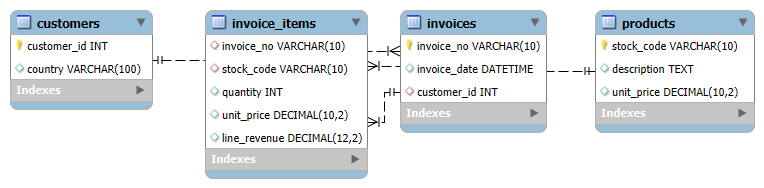
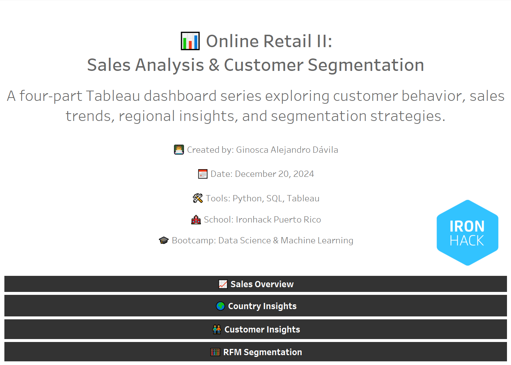
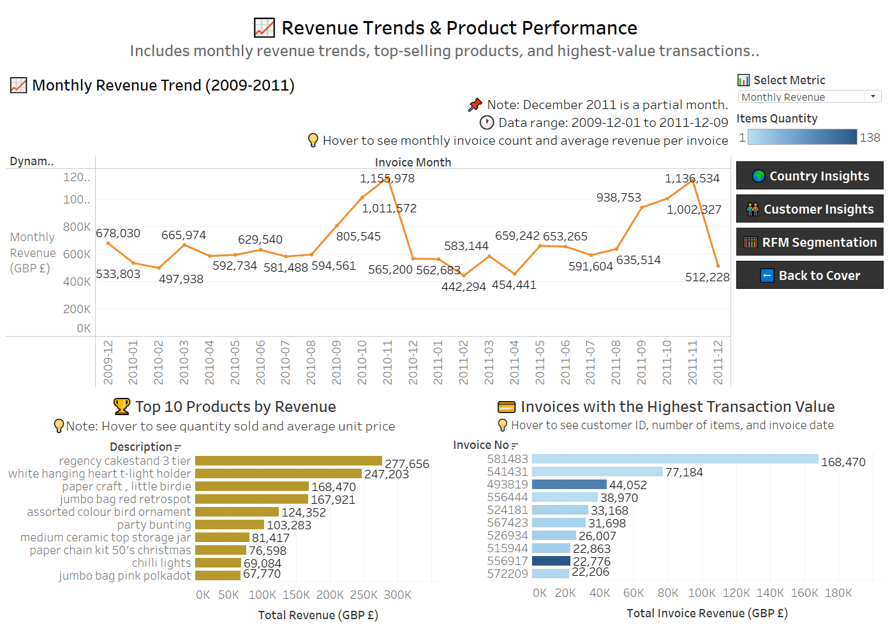
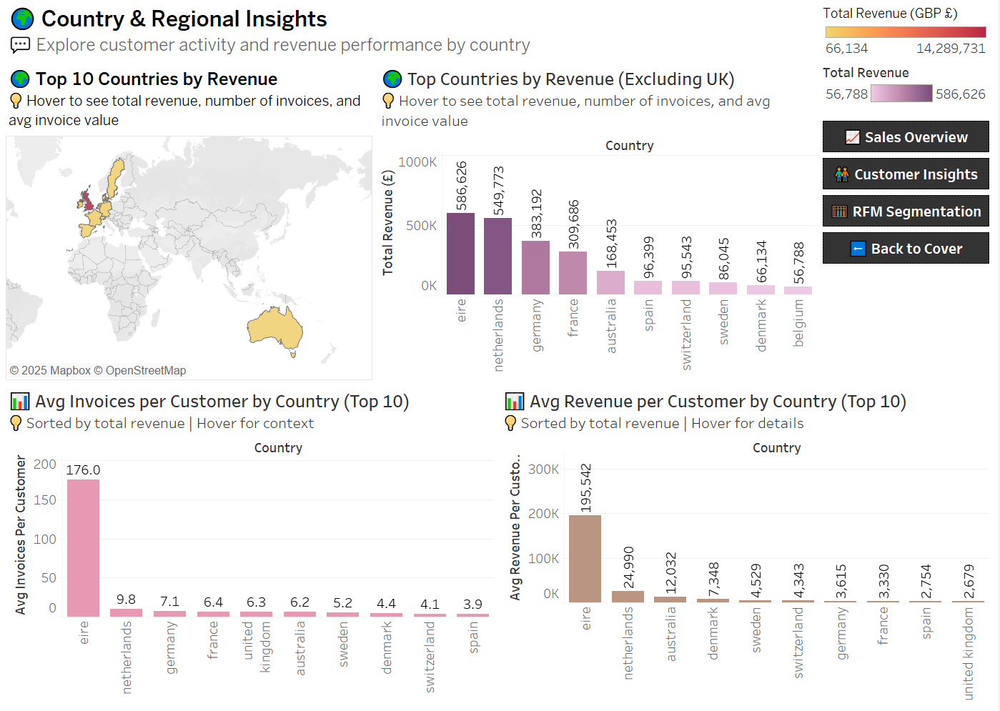
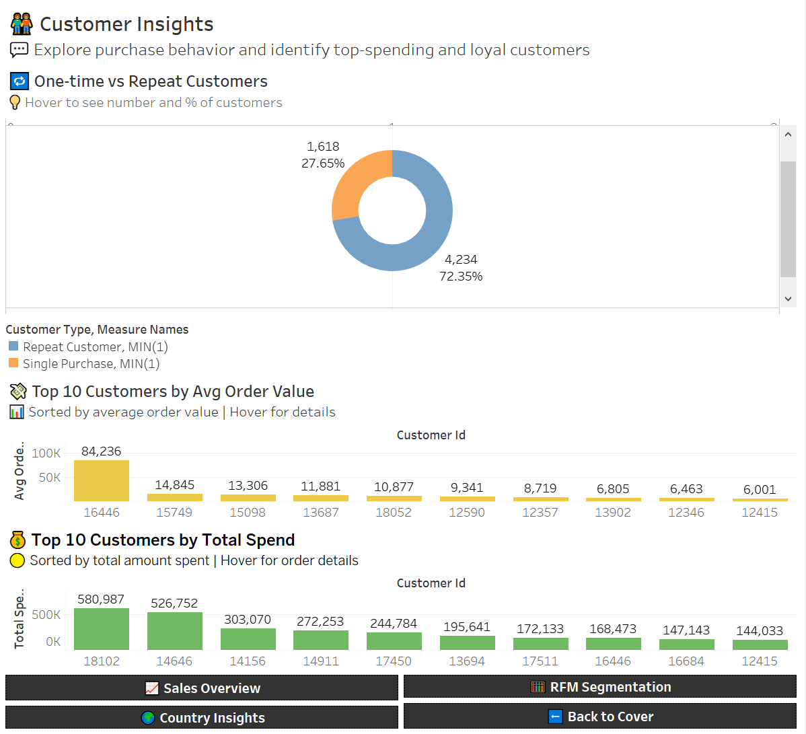
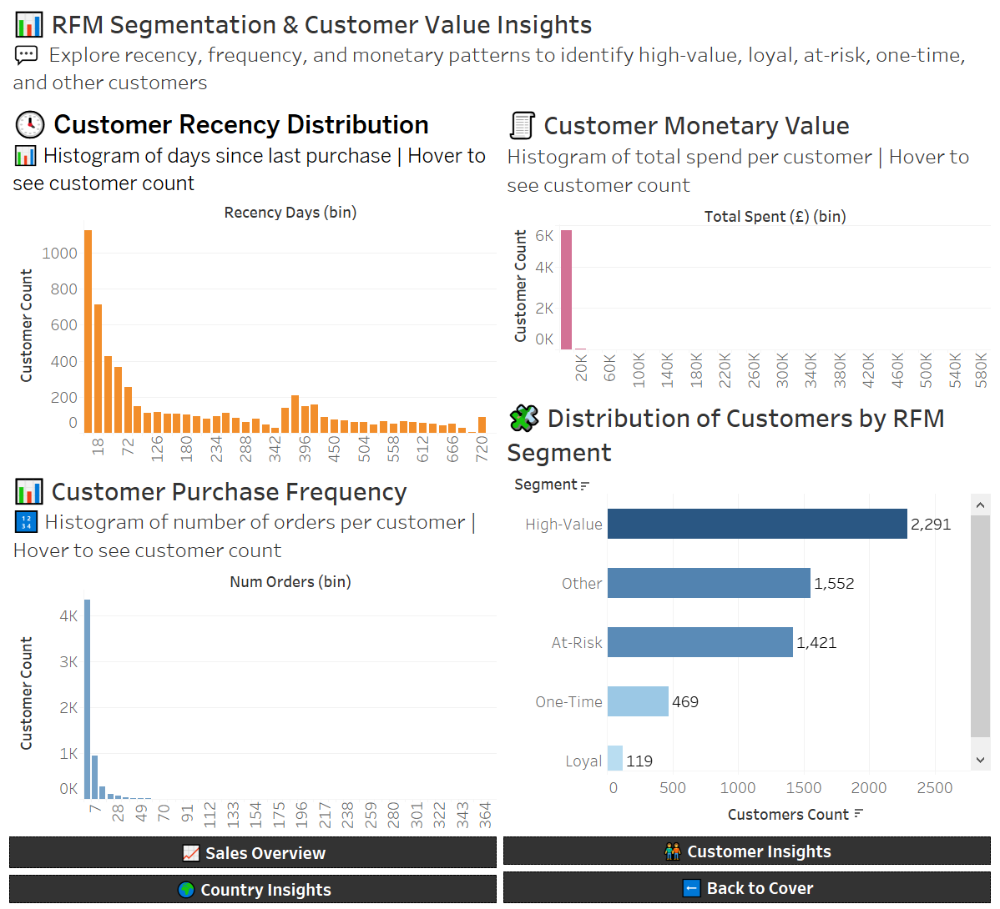

# 🛒 Retail Sales Analysis & Customer Segmentation (SQL Project)

**Bootcamp:** Data Science and Machine Learning – Ironhack Puerto Rico  
📅 **Date:** December 20, 2024  
👩‍💻 **Author:** Ginosca Alejandro Dávila  

This project analyzes **e-commerce transaction data** from a UK-based online retailer to uncover **revenue trends**, **product performance**, and conduct **RFM-based customer segmentation** using SQL. It demonstrates data cleaning, SQL and Python proficiency, KPI extraction, and schema deployment automation in a real MySQL environment.

---

## 📦 Dataset

- **Name:** Online Retail II  
- **Source:** UCI Machine Learning Repository  
- **Link:** [https://archive.ics.uci.edu/dataset/502/online+retail+ii](https://archive.ics.uci.edu/dataset/502/online+retail+ii)  
- **File:** `online_retail_II.xlsx`  
- **Sheets:**  
  - `Year 2009-2010`  
  - `Year 2010-2011`  
- **Records:** Over 1 million transactions across two years

### 📄 Features

| Column       | Description                                  |
|--------------|----------------------------------------------|
| InvoiceNo    | Invoice number (starts with 'C' if canceled) |
| StockCode    | Product ID                                   |
| Description  | Product name                                 |
| Quantity     | Number of items purchased                    |
| InvoiceDate  | Timestamp of purchase                        |
| UnitPrice    | Price per unit (GBP)                         |
| CustomerID   | Unique customer ID                           |
| Country      | Country of customer                          |



---

## 🎯 Objectives

- Clean and normalize raw transaction data  
- Design a relational SQL schema and load the data  
- Perform business KPI analysis using both SQL and Python  
- Implement **RFM segmentation** logic  
- Automate real-environment schema setup in **MySQL**  
- Define and use the MySQL database named `retail_sales` ⚙️  
- Visualize and interpret RFM-based segmentation in the Python SQL notebook (`3_sql_analysis_sales_performance_online_retail_ii.ipynb`) 🧠  

---

## 🧠 Business Questions to Answer

### 📈 Sales Performance
1. What is the monthly revenue trend from 2009 to 2011?  
2. What are the top 10 best-selling products by total revenue?  
3. Which invoices had the highest total transaction value?

### 🌍 Country & Regional Insights
4. Which countries generate the most revenue?  
5. Do customer behaviors differ by country? *(e.g., avg. spend or frequency)*

### 👤 Customer Insights
6. How many customers made only one purchase?  
7. What is the average order value per customer?  
8. Who are the top 10 customers by total spend?

### 🧠 Customer Segmentation (RFM Analysis)
9. How recently has each customer made a purchase? *(Recency)*  
10. How frequently has each customer purchased? *(Frequency)*  
11. How much revenue has each customer generated? *(Monetary)*  
12. How can we segment customers based on RFM scores using SQL logic?  
    - 🟢 Loyal  
    - 🟡 High-Value  
    - 🔴 At-Risk
    - 🔵 One-Time Buyer
    - ⚪ Other  

---

## 🛠️ Tools & Technologies

- **Google Colab**  
  Primary notebook environment used for data cleaning, exploratory data analysis (EDA), SQL query execution (via SQLite), exporting `.ipynb` notebooks to Python scripts and testing those scripts.

- **Jupyter Notebook**  
  Used locally to test Python scripts and automate MySQL schema creation and loading.

- **Anaconda Prompt**  
  Used to execute `.py` scripts from the command line for additional validation and testing.

- **Python**  
  Used for all data preparation, EDA, SQL execution (via `sqlalchemy`), customer segmentation (RFM), MySQL automation, and notebook/script orchestration.

- **MySQL**  
  Used to validate the relational schema and data, and to execute SQL business queries in a real database environment. The `retail_sales` schema was programmatically created using Python.

- **`dotenv` package**  
  Ensures secure MySQL credential handling using environment variables loaded from a `.env` file.

- **Git + GitHub**  
  Used for version control, collaboration, and sharing the project portfolio.


---

## 🗃️ Project Folder Structure

```
📂 retail-sales-segmentation-sql/
│
├── 📂 cleaned_data/
│   ├── cleaned_online_retail_II.csv
│   ├── customers.csv
│   ├── invoice_items.csv
│   ├── invoices.csv
│   └── products.csv
│
├── 📂 config/
│   └── mysql_credentials_template.txt
│
├── 📂 dashboard/
│   ├── online_retail_ii_dashboard.twbx                   
│   ├── tableau_dashboard_link.txt                        
│   └── dashboard_previews/                               
│       ├── dashboard_0_cover.png
│       ├── dashboard_1_sales_overview.png
│       ├── dashboard_2_country_insights.png
│       ├── dashboard_3_customer_insights.png
│       └── dashboard_4_rfm_segmentation.png
│
├── 📂 data/
│   └── online_retail_II.xlsx
│
├── 📂 eda_outputs/
│   ├── 📂 data/
│   └── 📂 plots/
│
├── 📂 images/
│   └── online_retail_ii_erd.png
│
├── 📂 notebooks/
│   ├── 1_data_cleaning_online_retail_ii.ipynb
│   ├── 2_eda_online_retail_ii.ipynb
│   ├── 3_sql_analysis_sales_performance_online_retail_ii.ipynb
│   ├── 4_mysql_real_env_setup_online_retail_ii.ipynb
│   ├── export_notebooks_to_py_online_retail_ii.ipynb
│   └── test_clean_scripts_colab_online_retail_ii.ipynb
│
├── 📂 reference/
│   └── project_2_eda_sql_project_instructions.md
│
├── 📂 reports/
│   ├── 📂 presentation/
│   │   ├── online_retail_ii_eda_and_sql_project_presentation.pdf
│   │   └── online_retail_ii_eda_and_sql_project_presentation.pptx
│   ├── 📂 python/
│   │   ├── 1_data_cleaning_report_online_retail_ii.md
│   │   ├── 2_eda_report_online_retail_ii.md
│   │   ├── 3_sql_analysis_report_online_retail_ii.md
│   │   └── 4_mysql_setup_report_online_retail_ii.md
│   └── 📂 sql/
│       ├── 1_sql_validation_report_online_retail_ii.md
│       └── 2_sql_business_questions_report_online_retail_ii.md
│
├── 📂 scripts/ → Python and SQL automation scripts  
│   ├── 📂 python/  
│   │   ├── 📂 annotated/ → Scripts with markdown-style comments  
│   │   │   ├── 1_data_cleaning_online_retail_ii.py  
│   │   │   ├── 2_eda_online_retail_ii.py  
│   │   │   ├── 3_sql_analysis_sales_performance.py  
│   │   │   └── 4_mysql_real_env_setup_online_retail_ii.py  
│   │   └── 📂 clean/ → Clean production-ready scripts (no markdown)  
│   │       ├── 1_data_cleaning_online_retail_ii.py  
│   │       ├── 2_eda_online_retail_ii.py  
│   │       ├── 3_sql_analysis_sales_performance.py  
│   │       └── 4_mysql_real_env_setup_online_retail_ii.py  
│   └── 📂 sql/  
│       └── 📂 queries/  
│           ├── 1_validate_online_retail_ii.sql  
│           └── 2_business_questions_online_retail_ii.sql  
│
├── 📂 sql_outputs/
│   ├── 📂 mysql_outputs/
│
│   └── 📂 notebook_outputs/
└── README.md

```

---

## ✅ Project Outcomes

- **SQL**  
  Schema creation, joins, CTEs, aggregates, and window functions.

- **Python EDA**  
  Exploratory analysis using `pandas` and `matplotlib`.

- **MySQL Automation**  
  Programmatic table creation and CSV loading using Python.

- **Business KPIs**  
  Analysis of revenue by month, top products, and customer spending.

- **Customer Segmentation**  
  Full RFM logic implemented using SQL-style scoring logic in Python.

- **Portfolio Readiness**  
  Clean GitHub repo with structure, documentation, and visual assets.

- **Comparison Environments**  
  SQL queries executed in both MySQL and Python environments.

- **Environment Agnostic**  
  Works seamlessly in both Google Colab (cloud) and local Jupyter setups.

---

## 📊 Tableau Dashboard – Online Retail II

Explore a 4-part interactive dashboard series analyzing sales performance, customer behavior, and segmentation.

🔗 **[View on Tableau Public](https://public.tableau.com/views/online_retail_ii_dashboard/dashboard_0_cover)**  
📁 `dashboard/online_retail_ii_dashboard.twbx` – Tableau workbook file  
📁 `dashboard/dashboard_previews/` – Preview images of each dashboard  

### 📸 Dashboard Previews

| Cover | Sales Overview |
|-------|----------------|
|  |  |

| Country Insights | Customer Insights | RFM Segmentation |
|------------------|-------------------|------------------|
|  |  |  |

---

## 🔐 MySQL Credential Setup (Optional)

To protect sensitive information, we recommend storing MySQL credentials in a `.env` file located in the `config/` folder.  
This allows scripts to securely load them as environment variables using the `dotenv` package.

> 🔒 This approach avoids hardcoding sensitive values directly into your source code and helps protect credentials in collaborative environments.

If the `.env` file is missing or partially filled, the script will automatically **prompt the user to manually enter any missing values**.  
This ensures that the notebook remains fully usable on any machine, whether or not an `.env` file is present.

---

### 🗂️ Configuration Instructions (Optional but Recommended)

**Option 1 – Use Prompt Mode (No Setup Needed)**  
Let the notebook prompt you for each credential when it's needed.

**Option 2 – Use a `.env` File (Recommended for Reuse and Safety)**

1. Open the provided template file:  
   `config/mysql_credentials_template.txt`

2. Fill in your own MySQL credentials:  

    ```
    MYSQL_HOST=127.0.0.1  
    MYSQL_PORT=3306  
    MYSQL_USER=your_username_here  
    MYSQL_PASSWORD=your_password_here  
    MYSQL_DATABASE=retail_sales  
    ```

   > 💡 `MYSQL_HOST` is typically `127.0.0.1` or `localhost`  
   > 💡 `MYSQL_PORT` is usually `3306`

3. Save the file and **rename it** to:  
   `mysql_credentials.env`

> 🔐 **Security Notes:**  
> - Add `.env` to your `.gitignore` file to avoid exposing credentials in public repositories.  
> - The actual `.env` file used in this project (and any `.txt` file with real credentials) is **excluded from this GitHub repo** for security.

---

## 📚 References

- **Dataset Source:** [UCI Online Retail II](https://archive.ics.uci.edu/dataset/502/online+retail+ii)

---

## 🛡️ License & Attribution

© 2024 Ginosca Alejandro Dávila  
Bootcamp: Data Science and Machine Learning – Ironhack Puerto Rico  
Project: Online Retail II – Sales Analysis & Customer Segmentation  
Date: December 20, 2024  
This project is released under the MIT License for educational and portfolio use.
